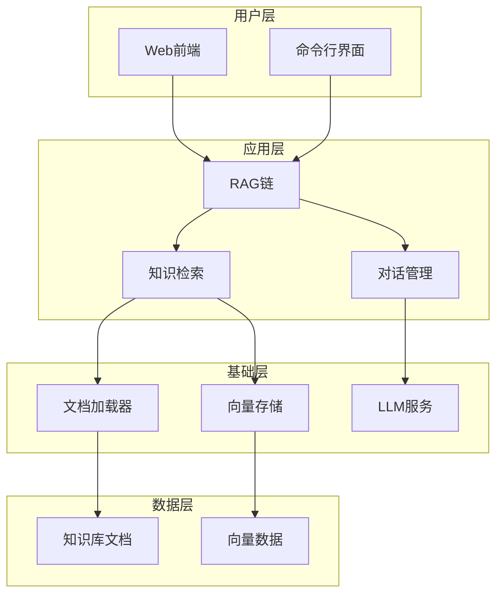
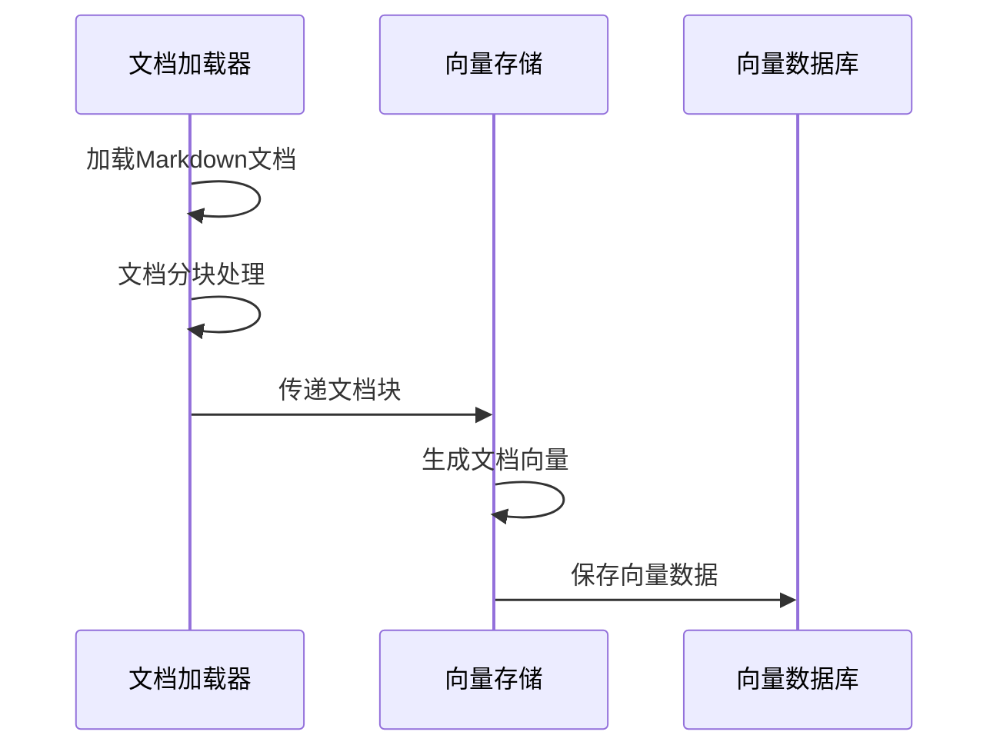
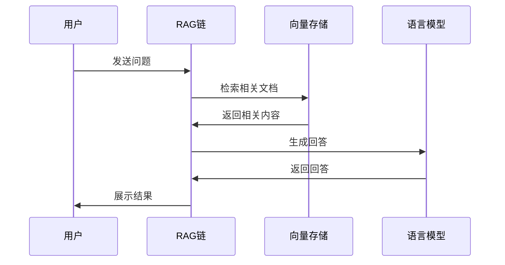

# 甜品日记智能客服系统技术架构

本设计文档详细描述了系统的功能需求、技术架构和实现细节。

本培训练习项目只关注AI客服基本功能实现，不涉及订单处理、用户管理、实体抽取等复杂功能。也不用考虑系统性能指标，安全和扩展性设计。

## 1. 系统架构图 


## 2. 核心组件说明

### 2.1 RAG链实现
- 使用LCEL构建RAG链
- 支持流式输出
- 实现异步处理
- 包含完整的错误处理

### 2.2 知识检索模块
- 使用FAISS向量数据库
- 支持相似度搜索
- 支持持久化存储
- 支持向量存储的加载和保存

### 2.3 文档处理模块
- 支持Markdown文档加载
- 实现文档分块
- 提供元数据管理
- 支持批量文档处理

### 2.4 用户界面
- Gradio Web界面
  - 支持流式输出
  - 提供示例问题
  - 包含队列管理
- 命令行界面
  - 支持异步交互
  - 提供基本的错误处理

## 3. 数据流程

### 3.1 知识库初始化流程


### 3.2 问答处理流程


## 4. 关键实现细节

### 4.1 RAG链实现
```python
chain = (
    RunnableParallel(
        {"context": _get_context, 
         "question": RunnablePassthrough()}
    )
    | prompt
    | llm
    | StrOutputParser()
)
```

### 4.2 向量存储实现
- 使用FAISS进行高效相似度搜索
- 支持本地持久化
- 提供向量数据的增量更新

### 4.3 文档处理实现
- 使用RecursiveCharacterTextSplitter进行文档分块
- 保留文档源信息作为元数据
- 支持多种分隔符

### 4.4 用户界面实现
- Gradio界面支持流式输出和队列管理
- 命令行界面支持异步交互
- 统一的错误处理机制

## 5. 部署说明

### 5.1 环境要求
- Python 3.10+
- 所有依赖包的最新版本
- 正确配置的环境变量

### 5.2 启动方式
- Web模式：`python main.py --mode web`
- CLI模式：`python main.py --mode cli`

### 5.3 配置项
- OpenAI API配置
- 向量存储路径配置
- 知识库路径配置
- 日志级别配置


